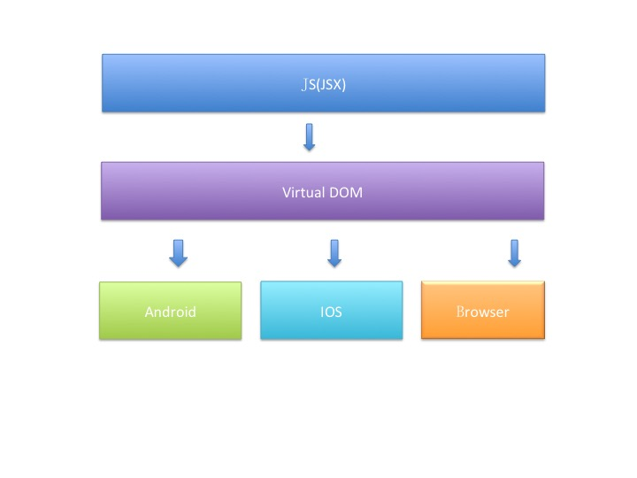
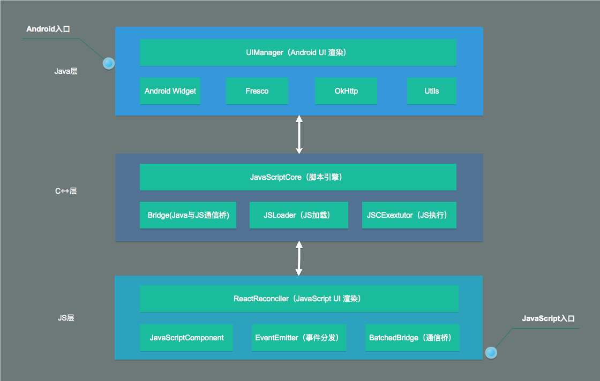
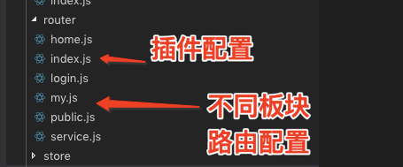
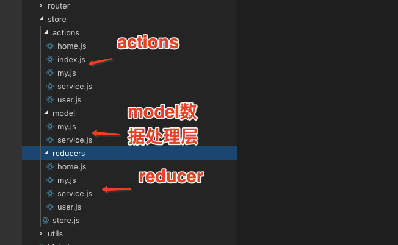
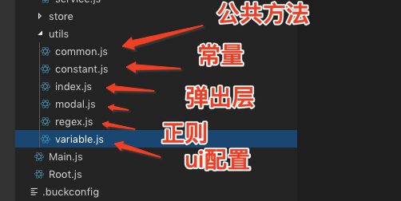

## React-Native 基本原理

### 1. 整体架构

RN 框架让 js 开发者可以大部分使用 js 代码构建跨平台 APP，Facebook 官方说法是 learn once, run everywhere， 即在 Android 、 IOS、 Browser 各个平台，程序画 UI 和写逻辑的方式都大致相同。因为 JS 可以动态加载，从而理论上可以做到 write once, run everywhere， 当然要做额外的适配处理。如图：



RN 需要一个 js 的运行环境，在 ios 上直接使用内置的 javascriptcore，在 android 上使用 webkit.org 官方开源的 jsc.so。此外还集成了其他开源组件，如 fresco 图片组件，okhttp 网络组件等。

RN 会把应用的 js 代码（包括依赖的 framework）编译成一个 js 文件（一般命名为 index.android.bundle）。RN 的整体框架目标就是为了解释运行这个 js 脚本文件，如果是 js 扩展的 api，则直接通过 bridge 调用 native 方法；如果是 ui 界面，则映射到 virtual Dom 这个虚拟的 js 数据结构中，通过 bridge 传递到 native，然后根据数据属性设置各个对应的真实 native 的 view。bridge 是一种 js 和 java 代码通信的机制，用 bridge 函数传入对方 module 和 method 即可达到异步回调的结果。

对于 js 开发者来说，画 ui 只画到 virtual DOM 中，不需要特别关心具体的平台，还是原来的单线程开发，还是原来的 html 组装 ui（jsx），还是原来的样式模型（部分兼容）。RN 的界面处理除了实现 View 增删改查的接口之外，还自定义一套样式表达 CSSLayout，这套 CSSLayout 也是跨平台实现。RN 拥有画 ui 的跨平台能力，主要是加入了 virtual DOM 编程模型，该方法一面可以照顾 js 开发者在 htmlDOM 的部分传承，另一方面可以让 virtualDOM 适配实现到各个平台，实现跨平台的能力，并且为未来增加更多的想象空间，比如 react-cavas,react-openGL。而实际上 react-native 也是从 reactjs 演变而来



### 2. 组件代码

```javascript
import React, { Component } from "react";
import { View, Text, StyleSheet, ActivityIndicator } from "react-native";

export default class Main extends Component {
  constructor(props) {
    super(props);
  }
  static defaultProps = {
    title: "处理中..."
  };
  render() {
    let { title } = this.props;
    return (
      <View
        style={{
          padding: 20,
          backgroundColor: "rgba(0, 0, 0, 0.7)",
          borderRadius: 10
        }}
      >
        <ActivityIndicator animating={true} size="large" color="#fff" />
        <Text style={{ color: "#fff", marginTop: 10 }}>{title}</Text>
      </View>
    );
  }
  componentDidMount = async () => {};
}
const style = StyleSheet.create({});
```

对于 js 开发者来说，整个 RN APP 就只有一个 js 文件，而开发者需要编写的就只有如上部分。主要是四个部分：

1. import 所有依赖的组件

2. class Main extends Component 创建 app，并且在 reader 函数中返回 ui 界面结构，实际经过编译，都会变成 js 代码。

3. const style = StyleSheet.create({}) 创建 css 样式，实际上会直接当作参数反馈到上面的 app

4. AppRegistry.registerComponent('AwesomeProject', () => AwesomeProject); 以上三个更像是参数，这个才是 JS 程序的入口。即把当前 APP 的对象注册到 AppRegistry 组件中， AppRegistry 组件是 js module

接着就等待 Native 事件驱动渲染 JS 端定义的 APP 组件

## 四小强之路由的设计封装



### 1、简单的路由页面配置

```javascript
import Home from "home/Home";
import NewList from "home/NewList";
import Product from "home/Product";
import NewDetail from "home/NewDetail";
import Icon from "react-native-vector-icons/FontAwesome";
const HomeRoute = {
  home: {
    screen: Home,
    navigationOptions: {
      header: null
    }
  }
};
export default HomeRoute;
```

### 2、利用 react-navigation 对配置文件进行封装

##### - tabbar 的封装

```javascript
/** @format */

import React, { Component } from "react";
import {
  createBottomTabNavigator,
  createStackNavigator,
  createAppContainer,
  getActiveChildNavigationOptions
} from "react-navigation";
import { Icon, Touchable, Button } from "ui";
import { StyleSheet, Platform, View } from "react-native";

import { transformSize } from "@/utils";
import lang from "@/assets/lang";
import home from "./home";
import service from "./service";
import my from "./my";
import common from "./public";
import login from "./login";

let tabNavRouteConfig = {
  home: {
    screen: home.home.screen,
    navigationOptions: ({ screenProps }) => ({
      tabBarLabel: screenProps.tabLabel.home,
      tabBarIcon: ({ tintColor, focused }) => (
        <Icon name={focused ? "home2" : "home1"} size={25} color={tintColor} />
      ),
      header: null
    })
  },
  service: {
    screen: service.service.screen,
    navigationOptions: ({ screenProps }) => ({
      tabBarLabel: screenProps.tabLabel.service,
      tabBarIcon: ({ tintColor, focused }) => (
        <Icon
          name={focused ? "service2" : "service1"}
          size={25}
          color={tintColor}
        />
      )
    })
  },
  my: {
    screen: my.my.screen,
    navigationOptions: ({ screenProps }) => ({
      tabBarLabel: screenProps.tabLabel.my,
      tabBarIcon: ({ tintColor, focused }) => (
        <Icon name={focused ? "wode2" : "wode1"} size={25} color={tintColor} />
      )
    })
  }
};

const TabNav = createBottomTabNavigator(tabNavRouteConfig, {
  animationEnabled: false,
  swipeEnabled: false,
  lazy: true,
  tabBarPosition: "bottom",
  tabBarOptions: {
    showIcon: true,
    activeTintColor: "#3fc375",
    inactiveTintColor: "#494949",
    labelStyle: {
      fontSize: 12
    },
    style: {
      height: transformSize(110)
    }
  }
});

TabNav.navigationOptions = ({ navigation, screenProps }) => {
  return getActiveChildNavigationOptions(navigation, screenProps);
};
```

##### - 整体路由的封装

```javascript
// const AppContainer = createAppContainer(TabNav);
const AppNavigator = createStackNavigator(
  {
    App: TabNav,
    ...home,
    ...service,
    ...my,
    ...common,
    ...login
  },
  {
    defaultNavigationOptions: ({ navigation }) => StackOptions({ navigation }),
    cardShadowEnabled: false,
    cardOverlayEnabled: true
  }
);

const AppContainer = createAppContainer(AppNavigator);

export default AppContainer;

const StackOptions = ({ navigation }) => {
  const tabBarVisible = false;
  const headerBackTitle = false;

  const headerStyle = {
    backgroundColor: "#fff",
    borderBottomWidth: 1,
    borderBottomColor: "#edebed",
    elevation: 0
  };

  const headerTitleStyle = {
    flex: 1,
    textAlign: "center",
    fontWeight: "600",
    color: "#333",
    fontSize: transformSize(36)
  };
  const headerTintColor = "#3fc375";
  const headerLeft = (
    <Button
      style={s.backButton}
      onPress={() => {
        navigation.goBack();
      }}
      icon="back"
      iconSize={20}
      iconColor="#666"
      title={lang.t("common.back")}
      textStyle={{
        color: "#666",
        marginLeft: transformSize(10),
        fontSize: transformSize(28)
      }}
    />
  );
  const headerRight = <View style={s.rightView} />;
  return {
    tabBarVisible,
    headerBackTitle,
    headerStyle,
    headerTitleStyle,
    headerTintColor,
    headerLeft,
    headerRight
  };
};
```

## 四小强之 axios 的封装结合


### 1、封装页面和 axios 调用的类

```javascript
/** @format */

import axios from "./axios";
import Qs from "qs";
import _pick from "lodash/pick";
import _assign from "lodash/assign";
import _merge from "lodash/merge";
import _isEmpty from "lodash/isEmpty";
import _isArray from "lodash/isArray";

import { assert } from "@/utils";
import { API_DEFAULT_CONFIG, AXIOS_DEFAULT_CONFIG } from "@/config";
import API_CONFIG from "@/api";

/**
 * 生成api接口类
 */
class Api {
  constructor(options) {
    this.api = {};
    this.apiBuilder(options);
  }

  /**
   * 创建工程接口
   * @param sep 分隔符
   * @param config 接口配置对象
   * @param mock 是否开启mock
   * @param debug 是否开启debug模式
   * @param mockBaseURL mock接口地址
   */
  apiBuilder({
    sep = "/",
    config = {},
    mock = false,
    debug = false,
    mockBaseURL = ""
  }) {
    Object.keys(config).map(namespace => {
      this._apiSingleBuilder({
        namespace,
        mock,
        mockBaseURL,
        sep,
        debug,
        config: config[namespace]
      });
    });
  }

  /**
   * 创建单个接口
   * @param sep 分隔符
   * @param config 接口配置对象
   * @param mock 是否开启mock
   * @param debug 是否开启debug模式
   * @param mockBaseURL mock接口地址
   */
  _apiSingleBuilder({
    namespace,
    sep = "/",
    config = {},
    mock = false,
    debug = false,
    mockBaseURL = ""
  }) {
    config.forEach(api => {
      const { name, desc, params, method, path, cache = true, headers } = api;
      let apiname = `${namespace}${sep}${name}`; // 接口调用名称 this.$api['apiname']()
      let url = path; // 接口地址
      const baseURL = mock ? mockBaseURL : AXIOS_DEFAULT_CONFIG.baseURL; // 接口base地址

      debug && assert(name, `${url} :接口name属性不能为空`);
      debug &&
        assert(url.indexOf("/") === 0, `${url} :接口路径path，首字符应为/`);

      Object.defineProperty(this.api, `${apiname}`, {
        value(outerParams, outerOptions) {
          // let _data = _isEmpty(outerParams) ? params : _pick(_assign({}, params, outerParams), Object.keys(params));
          let _data =
            _isArray(outerParams) || outerParams instanceof FormData
              ? outerParams
              : _merge({}, params, outerParams);

          /*特殊页面，需要对数据做处理*/
          if (
            (method.toUpperCase() === "POST" ||
              method.toUpperCase() === "PUT") &&
            (!headers || !headers.hasOwnProperty("Content-Type"))
          ) {
            _data = Qs.stringify(_data);
          }

          return axios(
            _normoalize(
              _assign(
                {
                  name,
                  url,
                  desc,
                  baseURL,
                  method,
                  headers: headers || null,
                  cache
                },
                outerOptions
              ),
              _data
            )
          );
        }
      });
    });
  }
}

/**
 * 根据请求类型处理axios参数
 * @param options
 * @param data
 * @returns {*}
 * @private
 */
function _normoalize(options, data) {
  //处理IE下请求缓存
  if (!options.cache) {
    options.url = `${options.url}${
      options.url.includes("?") ? "&" : "?"
    }_=${new Date().getTime()}`;
  }

  if (options.method === "POST" || options.method === "PUT") {
    options.data = data;
  } else if (options.method === "GET") {
    options.params = data;
  }
  return options;
}

/**
 * 导出接口
 */
export default new Api({
  config: API_CONFIG,
  ...API_DEFAULT_CONFIG
})["api"];
```

### 2、 使用 axios 接口拦截器

```javascript
import axios from "axios";

import { AXIOS_DEFAULT_CONFIG } from "@/config";
import {
  requestSuccessFunc,
  requestFailFunc,
  responseSuccessFunc,
  responseFailFunc
} from "@/config/interceptor/axios";

let axiosInstance = {};
axiosInstance = axios.create(AXIOS_DEFAULT_CONFIG);

// 注入请求拦截
axiosInstance.interceptors.request.use(requestSuccessFunc, requestFailFunc);

// 注入返回拦截
axiosInstance.interceptors.response.use(responseSuccessFunc, responseFailFunc);

export default axiosInstance;
```

### 3、 接口通过一下方式配置

```
export default [
  {
    name: "slide",
    method: "GET",
    desc: "轮播图",
    path: "/method/frappe.apis.apps.home.slides"
  }
];
```

## 四小强之 redux 的封装



### 1、reducer 的配置

```javascript
const DEFAULT_STATE = {
  homeData: {},
  slideData: [],
  newsData: [],
  newListData: [],
  newDetailData: {},
  productGroupData: [],
  productData: []
};
const USERDATA = {};
export default function(state = DEFAULT_STATE, action = {}) {
  switch (action.type) {
    case home.HOME_DATA:
      return { ...state, ...action.payload };
    case home.SLIDE_DATA:
      return { ...state, ...action.payload };
    case home.NEWS_DATA:
      return { ...state, ...action.payload };
    case home.NEW_LIST_DATA:
      return { ...state, ...action.payload };
    case home.NEW_DETAIL_DATA:
      return { ...state, ...action.payload };
    case home.PRODUCT_GROUP_DATA:
      return { ...state, ...action.payload };
    case home.PRODUCT_DATA:
      return { ...state, ...action.payload };

    default:
      return state;
  }
}
```

### 2、actions 的配置

```javascript
import $api from "@/plugins/api";
import { doAction } from "./index";

export const HOME_DATA = "HOME_DATA";

export const NEW_DETAIL_DATA = "NEW_DETAIL_DATA";

export const getHomeData = params =>
  doAction(params, "user/userInfo", "HOME_DATA", "homeData");

export const getNewDetailData = (params, url) =>
  doAction(
    params,
    "home/newsDetail",
    "NEW_DETAIL_DATA",
    "newDetailData",
    null,
    url
  );
```

同时封装调用接口的逻辑 doAction

```javascript
export function doAction(
  params,
  url,
  dispatchType,
  stateData,
  model,
  replaceUrl
) {
  console.log("e", params, url, dispatchType, stateData, model, replaceUrl);
  return dispatch => {
    return new Promise((resolve, reject) => {
      $api[url](params, replaceUrl)
        .then(res => {
          let newRes;
          if (model) {
            newRes = model(res.data.display);
          } else {
            newRes = res.data.display;
          }
          let reducer = {
            type: "",
            payload: {}
          };
          reducer.type = dispatchType;

          reducer.payload[stateData] = newRes;

          dispatch(reducer);
          resolve(newRes);
        })
        .catch(err => {
          reject(err);
        });
    });
  };
}
```

中间加一层 model 层，处理后台不规范数据

```javascript
export function serviceModel(data) {
  return data.map((item, index) => {
    return {
      title: item.plan_name || item.service_project_name,
      ...item
    };
  });
}

export function spDetailModel(data) {
  let tasks = data.tasks.map((item, index) => {
    return {
      ...item,
      description: item.description || ""
    };
  });
  return {
    ...data,
    tasks
  };
}
```

## 四小强之公共方法的封装



1. 封装在 utils 文件夹中
