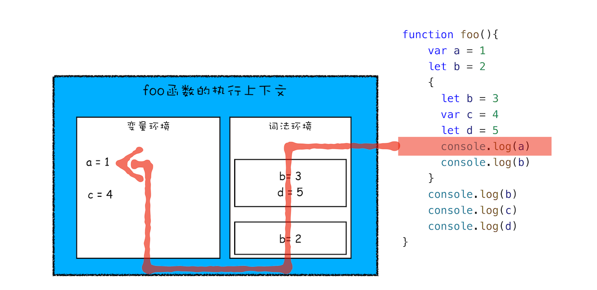
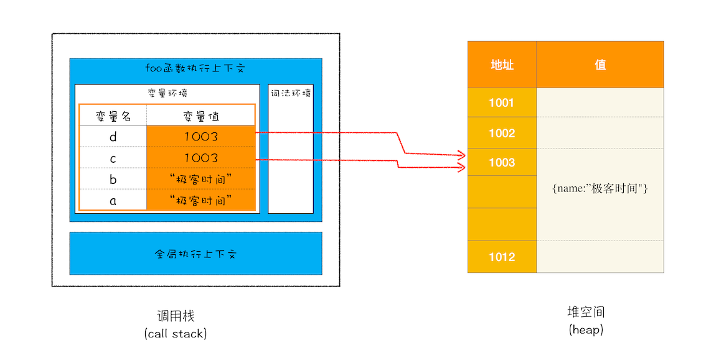

## 浏览器的执行顺序和结构

### 一. 什么是进程，什么是线程

并行处理：同一时刻处理多个任务，使用并行处理能大大提升性能

进程：并发执行程序的执行过程中资源分配和管理的基本单位

进程类似于工厂，是一个程序的运行实例，操作系统会为该程序创建内存，存放代码，运行中的数据和一个执行任务的主线程，这样的运行环境叫进程

线程：程序执行的最小单位

线程类似于工厂里的人，依附进程，不能单独存在，由进程来启动和管理。多线程并行处理能提升运算效率

进程和线程之间的关系有四个特点：

1. 进程中的任意一线程执行出错，都会导致整个进程的崩溃。类似于人疯了，工厂就停产了

2. 线程之间共享进程中的数据。 类似于每个人都可以使用工厂的资源

3. 当一个进程关闭之后，操作系统会回收进程所占用的内存。 类似于工厂倒闭了，国家收回工厂剩下的材料

4. 进程之间的内容互相隔离。 类似于工厂之间是隔离的，互相不知道各自的资源和行为方式，但可以通过出厂交流来通信

### 二. 浏览器使用什么架构

单进程：
早期（2007 年以前），浏览器的所有功能模块都运行在同一个进程里，包括网络，插件，js 运行环境，渲染引擎和页面等
问题：不稳定，一个线程崩溃导致整个浏览器的崩溃
不流畅，每个线程负责的功能多，如渲染，js 执行和插件都是运行在一个线程中，同一时刻只能有一个模块可以执行
不安全，插件和页面脚本也能访问进程中的数据

多进程
2008 年以后，chrome 形成如下的架构

每个页面运行在单独的渲染进程中，页面的插件也是运行在单独的插件进程中，进程之间通过 IPC 机制进行通信

目前的多进程架构

- 浏览器进程。主要负责界面显示、用户交互、子进程管理，同时提供存储等功能。
- 渲染进程。核心任务是将 HTML、CSS 和 JavaScript 转换为用户可以与之交互的网页，排版引擎 Blink 和 JavaScript 引擎 V8 都是运行在该进程中，默认情况下，Chrome 会为每个 Tab 标签创建一个渲染进程。出于安全考虑，渲染进程都是运行在沙箱模式下。
- GPU 进程。其实，Chrome 刚开始发布的时候是没有 GPU 进程的。而 GPU 的使用初衷是为了实现 3D CSS 的效果，只是随后网页、Chrome 的 UI 界面都选择采用 GPU 来绘制，这使得 GPU 成为浏览器普遍的需求。最后，Chrome 在其多进程架构上也引入了 GPU 进程。
- 网络进程。主要负责页面的网络资源加载，之前是作为一个模块运行在浏览器进程里面的，直至最近才独立出来，成为一个单独的进程。
- 插件进程。主要是负责插件的运行，因插件易崩溃，所以需要通过插件进程来隔离，以保证插件进程崩溃不会对浏览器和页面造成影响。

### 三、输入 URL 后浏览器是如何处理的

整个过程需要各个进程之间的配合：

- 浏览器进程主要负责用户交互、子进程管理和文件储存等功能。
- 网络进程是面向渲染进程和浏览器进程等提供网络下载功能。
- 渲染进程的主要职责是把从网络下载的 HTML、JavaScript、CSS、图片等资源解析为可以显示和交互的页面。因为渲染进程所有的内容都是通过网络获取的，会存在一些恶意代码利用浏览器漏洞对系统进行攻击，所以运行在渲染进程里面的代码是不被信任的。这也是为什么 Chrome 会让渲染进程运行在安全沙箱里，就是为了保证系统的安全

1. 用户输入

- 如果是搜索内容，地址栏会使用浏览器默认的搜索引擎，
- 如果输入内容符合 URL 规则，浏览器会根据规则，给内容加上协议，浏览器进程进入加载状态

2. URL 请求过程

- 浏览器进程会通过 IPC 把 URL 请求发给网络进程
- 网络进程查找本地是否缓存了资源，若有，直接返回资源，若没有，进入请求流程
- DNS 解析，若有 DNS 缓存，直接用，若没有，会向 DNS 服务器请求
- 建立 TCP 连接，三次握手
- 浏览器构建请求行，请求头，cookie 等信息，向服务器发送构建的请求
- 服务器接收到请求，会根据请求信息生成相应数据（行，头，体），并发给浏览器的网络进程
- 浏览器接收到服务器的响应头后，网络进程开始解析，如果发现返回的状态吗是 301 或 302，会重定向
- 网络进程从响应头的 location 读取重定向的地址，然后重新发起新的 http 或者 https 请求，一切从头开始

3. 准备渲染进程
   默认情况下，chrome 会为每个页面分配一个渲染进程；但如果从一个页面打开另一个新页面，新页面和当前页面属于同一站点的话，新页面会复用父页面的渲染进程

- 网络进程读取响应头信息后，会告知浏览器进程准备
- 浏览器进程准备渲染进程，并向渲染进程发出‘提交文档’的指令
- 渲染进程收到后，会和网络进程建立传输数据的“管道”
- 文档数据传输完成之后，渲染进程会返回“确认提交”的指令给浏览器进程
- 浏览器收到后，会更新浏览器界面状态

4. 渲染阶段

- 构建 dom 树，将 html 转换为浏览器能理解的结构
- 样式计算，将 css 转换为浏览器理解的结构；转换属性，使其标准化；计算 dom 树中每个节点的具体样式
- 布局阶段：创建布局树，布局计算
- 分层：类似于图层，根据布局树各节点的属性判断
- 绘制：把一个图层的绘制拆分很多小的指令，然后把这些指令按照顺序组成一个待绘制的列表
- 栅格化操作，此时具体绘制工作交给了合成线程来操作，合成线程会将图层分为图块，图层是横向的，图块是纵向纬度，合成线程按照视口附近的图块优先生成位图，图块变位图是有 GPU 生成的，GPU 又是在 GPU 进程中，因此合成线程主要起调度作用，真正合成位图是有 GPU 进程完成的。
- 位图全部生成后，合成线程发出一个指令给浏览器进程，浏览器将页面内容绘制到内存中，最后再将内存显示在屏幕上。

### 四、javascript 在浏览器中是如何执行的

#### 1. 变量提升

在 js 代码执行过程中，js 引擎把变量的声明部分和函数的声明部分提升到代码开头的行为

- 一段 js 代码在执行前需要被 js 引擎编译，再执行
- 编译阶段，会在执行环境中产生变量环境和可执行代码
  

#### 2. 栈溢出

js 中有很多函数，经常出现一个函数中调用另一个函数的情况，调用栈就是用来管理函数调用关系的一种数据结构

什么是栈？：一种满足后进先出的数据结构

什么是 js 的调用栈：js 利用栈管理执行上下文，js 引擎会将创建好的执行上下文压入栈中

所以全局上下文在最底层，随着 js 执行，不断有执行上下文推入到调用栈中，若有函数调用函数，就继续推入，执行后退出，再加入新的执行上下文。

由于调用栈是有大小的，所以当入栈的执行上下文超过一定数目，js 引擎就会报错，这种错误就是栈溢出，入终止条件不合适的递归函数。

#### 3. 作用域

作用域是指在程序中定义变量的区域，该位置决定了变量的生命周期。

- 全局作用域：对象在代码中的任何地方都能访问，其生命周期伴随着页面的生命周期
- 函数作用域：函数内部的变量或者函数，只能在内部被访问，函数执行结束后，变量会被销毁

js 引入了变量提升机制，没有块级作用域；

- 变量容易在不被察觉的情况下被覆盖掉
- 本应销毁的变量没有被销毁

加入了 let 和 const ，实现块级作用域

- 函数内部通过 var 声明的变量，在编译阶段全都存放到变量环境中
- 通过 let 或 const 声明的变量，在编译阶段会被存放到词法环境中
- 作用域块中通过 let 声明的变量，会被存放在词法环境的一个单独区域
  

#### 4. 作用域链和闭包

其实每个执行上下文的变量环境中，都包含了一个外部引用，用来指向外部的执行上下文；

当函数中使用了外部变量，会向外部引用查找，这样的一个查找链条就成为作用域链

> 词法作用域：静态作用域，由代码中函数声明的位置决定的

上图中 bar 函数和 foo 函数的外部引用都是指向全局，因为其定义的地方是在全局下

因此词法作用域是代码阶段就决定好的，和函数如何调用没有关系。

块级作用域+作用域链条

> 闭包：根据词法作用域的规则，内部函数总是可以访问其外部函数中声明的变量，当通过调用一个外部函数返回一个内部函数后，即使该外部函数已经执行结束了，但是内部函数引用外部函数的变量依然保存在内存中，我们就把这些变量的集合称为闭包。

#### 5. this

> 在对象内部的方法中访问对象内部的属性是一个非常普遍的需求，因此 js 引入了 this 机制

执行上下文都有一个 this

而执行上下文分为全局和函数

- 全局中的 this 指向 window；
- 当函数作为对象的方法调用时，函数中的 this 就是该对象；
- 当函数被正常调用时，在严格模式下，this 值是 undefined，非严格模式下 this 指向的是全局对象 window；
- 嵌套函数中的 this 不会继承外层函数的 this 值。
- 箭头函数没有自己的执行上下文，所以箭头函数的 this 就是它外层函数的 this。

### 四、 V8 工作原理

#### 1. 数据是如何存储的？

静态语言： 在使用之前需要确认其变量数据类型

动态语言：在运行过程中检查数据类型

隐式类型转换：在赋值过程中，把不同类型的变量悄悄转换，进行赋值；

支持隐式类型转换的语言称为弱类型语言，不支持隐式类型转换的语言称为强类型语言

js 是弱类型，动态语言

js 在执行过程中，主要有三种类型内存空间，分别为代码空间，栈空间，堆空间

栈空间，将变量存储在调用栈中，仅原始类型的数据可以存储，速度块，效率高，体积小

堆空间，将变量存储在堆内存中，引用类型的数据可以存储，体积很大，速度效率相对栈空间慢

原始类型的赋值会完整复制比变量值，而引用类型的赋值是复制引用地址，如下图：

再来回到闭包：产生闭包核心有两步：

- 预扫描内部函数
- 把内部函数引用的外部变量保存到堆中，无论其类型。

#### 2. 垃圾数据是如何自动回收的

数据分为两种，栈中的数据，堆中的数据

调用栈中的数据是如何回收的？

当一个函数执行完成之后，就需要销毁其执行上下文了，这时在调用栈中会有一个记录当前执行状态的指针，指针移动到下一层的执行上下文，当有新的执行上下文进来时，会覆盖掉指针上面的执行上下文，如图所示：

堆中的数据时如何回收的？

使用 js 的垃圾回收器

V8 会把堆分为新生代和老生代两个区域，新生代存放生存时间短的对象，老生代中存放生存时间久的对象

新生区小，支持 1 ～ 8M 的容量，老生区大很多

副垃圾回收器，主要负责新生代的垃圾回收，主垃圾回收器，主要负责老生代的垃圾回收

新生代中用 Scavenge 算法，把新生代空间对半划分为两个区域，一半对象区域一半空闲区域；新加入的对象都会放到对象区域，当对象区域快被写满时，执行一次垃圾清理操作。即标记清理，然后将存活的对象复制到空闲区域，同时把这些对象有序的排列起来，此时角色翻转，对象区域和空闲区域对调，以此无限循环下去

对象晋升策略：由于新生区空间不大，存活的对象很容易装满整个区域，因此经过两次垃圾回收依然存活的对象，会被移动到老生区中

老生区中的垃圾回收，除了新生区中晋升的对象，一些大的对象会直接分配到老生区，因此老生区对象有两个特点：

- 占用空间大
- 存活时间长

老生区使用标记-清除（Mark-Sweep）算法，首先是标记，当函数退出后，调用栈中没有了对数据的引用，此数据被标记为垃圾数据，执行清除，清除后会产生大量不连续的生存碎片，碎片过多会导致大对象无法分配到足够的连续内存，因此还需要整理，所有存活的对象都向一端移动，

#### 3. 编译器和解释器：V8 是如何执行一段 javascript 代码的

编译型语言：在程序执行之前，会通过编译器进行编译，编译之后会直接保留机器能读懂的二进制文件，这样到执行阶段时，可以直接运行该二进制文件，而不需要重新编译了

解释型语言：在每次运行时都需要通过解释器对程序进行动态解释和执行

如图：

- 编译型语言的编译过程中，编译器首先会依次对源代码进行词法分析，语法分析，生成抽象语法树（AST），然后是优化代码，最后再生成处理器能够理解的机器码。如果编译成功，将会生成一个可执行的文件。但如果编译过程发生了语法或者其他错误，那么编译器就会抛出异常，最后的二进制文件也不会生成成功。

- 在解释性语言的解释过程中，是逐行解释的，同样解释器也会对源代码进行词法分析，语法分析，并生成抽象语法树(AST)，不过它会再基于抽象语法树生成字节码，最后再根据字节码来执行程序，输出结果。

javascript 执行过程：

- 生成抽象语法树(AST)和执行上下文；首先是分词（词法分析），然后是解析（语法分析）
- 生成字节码；字节码是介于 AST 和机器码之间的一种代码，字节码需要解释器将其转换为机器码后才能执行
- 执行代码：逐条解释执行，若一段代码被重复执行多次，后台的编译器会把这段代码编译为高效的机器码，当再次执行这段被优化的代码时，只需要执行编译后的机器码就可以了，大大提升了代码的执行效率

这种字节码配合解释器和编译器称为即时编译。

因此 js 执行的性能优化有以下几点：

单次脚本的执行时间；脚本的网络下载；

- 提升单次脚本的执行速度，避免 js 长任务霸占主线程
- 避免大的内联脚本，因为在解析 html 的过程中， 解析和编译也会占用主线程
- 减少 js 文件的容量，因为更小的文件会提升下载速度，并且占用更低的内存

