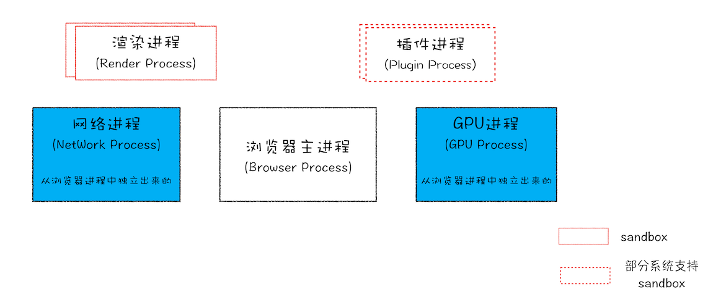

## 浏览器的执行顺序和结构

### 一. 什么是进程，什么是线程

并行处理：同一时刻处理多个任务，使用并行处理能大大提升性能

进程：并发执行程序的执行过程中资源分配和管理的基本单位

进程类似于工厂，是一个程序的运行实例，操作系统会为该程序创建内存，存放代码，运行中的数据和一个执行任务的主线程，这样的运行环境叫进程

线程：程序执行的最小单位

线程类似于工厂里的人，依附进程，不能单独存在，由进程来启动和管理。多线程并行处理能提升运算效率

进程和线程之间的关系有四个特点：

1. 进程中的任意一线程执行出错，都会导致整个进程的崩溃。类似于人疯了，工厂就停产了

2. 线程之间共享进程中的数据。 类似于每个人都可以使用工厂的资源

3. 当一个进程关闭之后，操作系统会回收进程所占用的内存。 类似于工厂倒闭了，国家收回工厂剩下的材料

4. 进程之间的内容互相隔离。 类似于工厂之间是隔离的，互相不知道各自的资源和行为方式，但可以通过出厂交流来通信

### 二. 浏览器使用什么架构

单进程：
早期（2007 年以前），浏览器的所有功能模块都运行在同一个进程里，包括网络，插件，js 运行环境，渲染引擎和页面等
问题：不稳定，一个线程崩溃导致整个浏览器的崩溃
不流畅，每个线程负责的功能多，如渲染，js 执行和插件都是运行在一个线程中，同一时刻只能有一个模块可以执行
不安全，插件和页面脚本也能访问进程中的数据

多进程
2008 年以后，chrome 形成如下的架构

每个页面运行在单独的渲染进程中，页面的插件也是运行在单独的插件进程中，进程之间通过 IPC 机制进行通信

目前的多进程架构

- 浏览器进程。主要负责界面显示、用户交互、子进程管理，同时提供存储等功能。
- 渲染进程。核心任务是将 HTML、CSS 和 JavaScript 转换为用户可以与之交互的网页，排版引擎 Blink 和 JavaScript 引擎 V8 都是运行在该进程中，默认情况下，Chrome 会为每个 Tab 标签创建一个渲染进程。出于安全考虑，渲染进程都是运行在沙箱模式下。
- GPU 进程。其实，Chrome 刚开始发布的时候是没有 GPU 进程的。而 GPU 的使用初衷是为了实现 3D CSS 的效果，只是随后网页、Chrome 的 UI 界面都选择采用 GPU 来绘制，这使得 GPU 成为浏览器普遍的需求。最后，Chrome 在其多进程架构上也引入了 GPU 进程。
- 网络进程。主要负责页面的网络资源加载，之前是作为一个模块运行在浏览器进程里面的，直至最近才独立出来，成为一个单独的进程。
- 插件进程。主要是负责插件的运行，因插件易崩溃，所以需要通过插件进程来隔离，以保证插件进程崩溃不会对浏览器和页面造成影响。

### 三、输入 URL 后浏览器是如何处理的
