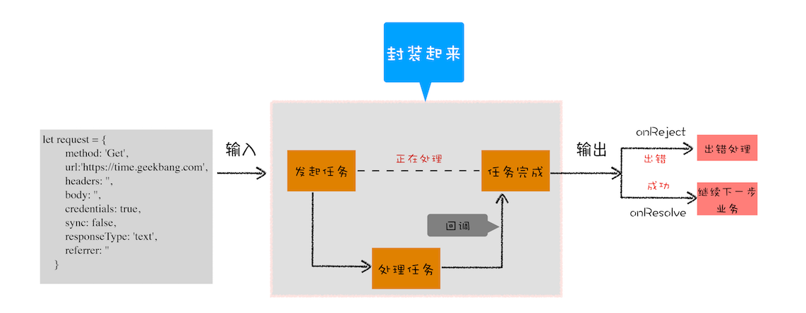

## 消息队列和事件循环

> 每一个渲染进程都有一个主线程，既要处理 DOM，又要计算样式，还要处理布局，同时还需要处理 js 任务以及各种输入事件。要让这么多不同类型的任务在主线程中有条不紊执行，需要一个系统来统筹调度，这个系统就是消息队列和事件循环系统

队列：先进先出


- 一个消息队列用来调度任务，接收其他线程的任务
- IO 线程用来接收其他进程产生的任务
- 渲染主线程会循环的从消息队列头部中读取任务，执行任务

**消息队列中的任务类型**

- 输入事件（鼠标滚动、点击、移动）
- 微任务
- 文件读写
- websocket
- js 定时器
- js 执行，解析 DOM，样式计算，布局计算，css 动画

### 宏任务微任务

消息队列中的任务执行过程中，会产生新的任务，如果将这些新产生的任务添加到消息队列尾部，那么这些任务会丧失实时性，如果任务直接出发，阻断当前任务的执行，又会影响当前任务的执行效率

所以最好的时机是：当前任务执行完，下个任务开始前；

eg: dom 节点的监控；

> 消息队列中的任务称为宏任务，每个宏任务都包含了一个微任务队列，在执行宏任务的过程中，产生的微任务会添加到列表中，当宏任务主要功能执行完后，会执行当前宏任务的微任务列表

**宏任务**

- 渲染事件（如解析 DOM、计算布局、绘制）
- 用户交互事件（如鼠标点击、滚动页面、放大缩小等）
- JavaScript 脚本执行事件
- 网络请求完成、文件读写完成事件

宏任务可以满足我们大部分的日常需求，不过如果有对时间精度要求较高的要求，宏任务就难以胜任了。
页面的渲染事件、各种 IO 的完成事件、执行 js 脚本的事件、用户交互的事件等都随时有可能被添加到消息队列中，而且添加事件是由系统操作的，js 代码不能准确掌控任务要添加到队列中的位置，因此很难控制开始执行任务的时间。

**微任务**

> 微任务就是一个需要异步执行的函数，执行时机是在主函数执行结束之后、当前宏任务结束之前

1. 微任务的产生

   - 使用 MutationObserver 监控某个 DOM 节点，通过 JS 修改这个节点，当 DOM 发生变化时，就会产生 DOM 变化记录的微任务

   - Promise，当调用 Promise.resolve()或者 reject 时

2. 微任务的执行

   - 宏任务快执行完成时，也就在 js 引擎准备退出全局执行上下文并清空调用栈的时候，js 会检查全局执行上下文的微任务队列

   - 在执行微任务的过程中，产生了新的微任务，同样会将该微任务添加到微任务队列中，v8 引擎一直循环执行微任务队列中的任务，直到队列为空才算执行结束


- 微任务和宏任务是绑定的，每个宏任务执行时，会创建自己的微任务队列
- 微任务的执行时长会影响到当前宏任务的时长。
- 在一个宏任务中，分别创建一个用于回调的宏任务和微任务，无论什么情况，微任务都早于宏任务执行

### Promise

> 单线程架构决定了 web 页面的异步回调，而多次回调会导致代码的逻辑不连贯、不线性。Promise 封装异步代码，让处理流程变得线性



我们来看一下 Promise 的常用用法

```javascript
let b = function(resolve, reject) {
  let xhr = new XMLHttpRequest()
  xhr.open('get', 'url', true)
  xhr.ontimeout = function(e) {
    reject(e)
  }

  xhr.onreadystatechange = function() {
    resolve(this.responseText, this)
  }
}
let a = new Promise(b)

a.then(res => {}).catch(e => {})
```

观察上面代码，可以发现：

- 构建 Promise 对象时，需要传入一个 b 函数，业务流程都在 b 函数中执行
- 如果运行 b 函数中的业务执行成功了，会调用 resolve 函数；如果执行失败，则调用 reject 函数
- 在 b 函数中调用 resolve 函数时，会触发 Promise.then 中设置的回调函数;调用 reject 函数时，会触发 Promise.catch 设置的回调函数

**首先，Promise 实现了回调函数的延时绑定**
其在代码上的提现就是先创建了 Promise，执行业务逻辑；再使用 then 来设置回调函数。resolve 函数会触发设置的回调函数

```javascript
function b(resolve, reject) {
  resolve(100)
}
let a = new Promise(b)

function onResolve(value) {
  console.log(value)
}

a.then(onResolve)
```

**其次，需要将回调函数 onResolve 的返回值穿透到最外层**

```javascript
function resolve(value) {
  let a2 = new Promise((resolve, reject) => {
    resolve(value)
  })
  return a2 //then的返回值也是一个promise
}
```

这样就可以实现透传：a.then().then(value);实现透传之后，Promise 对象的错误就具有冒泡性质，会一直向后传递，知道被 catch

**我们来实现一个简易版 Promise**

```javascript
const PENDING = 'pending'
const RESOLVED = 'resolved'
const REJECTED = 'rejected'

function MyPromise(fn) {
  this.state = PENDING
  this.value = null
  this.resolveCallbacks = []
  this.rejectCallbacks = []
  const that = this

  function resolve() {
    //   这个地方实际用的是微任务，目的是让then中的回调先执行
    setTimeout(function() {
      if (that.state === PENDING) {
        that.resolveCallbacks.forEach(item => {
          item(that.value)
        })
      }
    }, 0)
  }

  function reject() {
    同上
  }

  try {
    fn(resolve, reject)
  } catch (e) {}
}

// 简易版

MyPromise.prototype.then = function(cb) {
  const that = this
  //   简易的透传，cb不存在时
  cb = typeof cb === 'function' ? cb : v => v
  if (that.state === PENDING) {
    that.resolvedCallbacks.push(cb)
  }
  if (that.state === RESOLVED) {
    cb(that.value)
  }
}
// then函数返回Promise
MyPromise.prototype.then = function(cb) {
  const that = this
  if ((that.state = PENDING)) {
    return new MyPromise((resolve, reject) => {
      that.resolvedCallbacks.push(() => {
        const x = cb(that.value) //此时执行了then1的回调
        resolve(x) //返回上一步的返回值
      })
    })
  }
}
```
