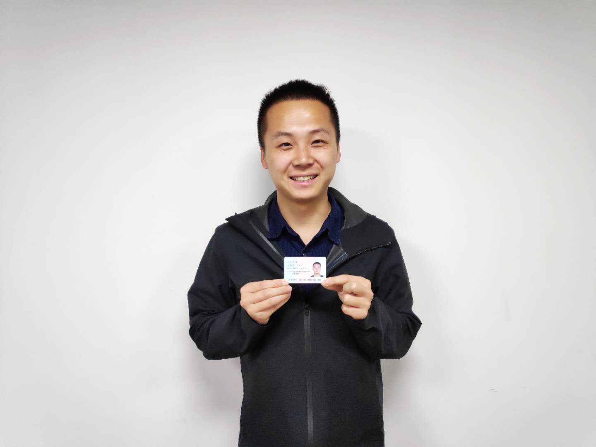

## 个人信息

- 王逵 / 男 / 出生 1991 / 13100671550 / 872505550@qq.com
- 本科 / 华中农业大学 / 动物医学 / 从事 web 大前端年限：8 年+
- 个人网站： [http://www.dadafastrun.com](http://www.dadafastrun.com)
- 微信公众号：前端自学社区联盟
- GitHub：[https://github.com/kui-wang-dada](https://github.com/kui-wang-dada)
- 职位期望：Web 前端工程师 / 全栈工程师 / 税前月薪 18k+ / 武汉

## 技能栈

- 熟练：React / Web3 / React-Native / Next / Vue / Nuxt
- 熟悉：Solidity / Node / Electron / Python
- 自己练手：nginx / docker  / golang+goframe

## 工作经历

### 区块链公司 （2022 年 3 月～ 2023 年 10 月）

> 前端负责人，后端协作。技术栈：Web3+React+Python

1. bluez 项目 （ NFT 图片交易平台 ） 前端负责人。难点：多链合约的封装，Graphql+Redux 封装前端数据层，Nextjs 的 SEO 优化，NFT 合约交易封装（报价 / 挂 单 / 售卖 / Seaport 集成），国际化和移动端适配。线上地址：https://bluez.app; 
2. noname 项目 （ NFT 域名交易平台 ） 前端负责人。难点同上，线上地址：https://noname.monster 
3. Sio2（虚拟币投资平台） 前端负责人。负责：模仿 aave,starlay 独立开发前端；难点：智能合约 Abi 集成，合约中间件，web3 连接。线上地址：https://sio2.finance
4. 协助开发 Astriddao 前端，负责：stake 逻辑，移动端响应式； 线上地址：https://app.astriddao.xyz/

### 厚仁教育有限公司（2019 年 3 月～ 2022 年 3 月）

> 前端负责人，独立开发。熟悉技术栈：react(reactnative,taro,next)，vue(nuxt,uniapp)，flutter，cordova 等

1. 开发 4 个 App。 负责：前端独立开发，项目流程控制； 技术栈：cordova1.0，ReactNative2.0，flutter3.0； 攻克难点： 业务对接 / 需求归纳整理 / 架构设计 / 更新策略 / 消息推送 / 测试发布 / 数据埋点 / 微信和指纹登录 / 国际化等
2. erp 企业管理系统。 负责：平台前端实现。 技术栈：React+Antd+Formily；攻克难点：antd 及其周边熟练应用 / formily schema 运用
3. 7 个多端小程序。 负责：探讨需求+独立开发； 技术栈：主 Taro 兼 Uniapp； 攻克难点：微信功能对接 / 各平台兼容
4. 8 个网站。 重构企业各部门对外网站。 负责：确定需求，独立开发； 技术栈：nuxt 服务端渲染 / spa+vue； 攻克难点：seo 优化 / 图表渲染

### 科大讯飞有限公司（2018 年 4 月～ 2019 年 3 月） 悠然一指有限公司 / 云里服务（2016 年 10 月～ 2018 年 4 月）

> 前期单个项目维护，后期泉山项目群负责人：+项目广度，+Vue 深入理解，+前端小组工作管理

相关技术栈：Vue 全家桶 / 权限路由 / Echarts 地图 / React-Native / Electron / Egret和白鹭引擎

### 自学相关

1. Python开发后台管理系统
1. Node+Nuxt 开发微信公众号后台
2. Golang+React+antd 构建后台管理系统
3. docker + nginx 容器部署+服务器上线
